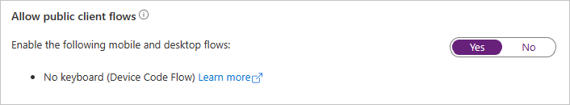

<!-- markdownlint-disable MD002 MD041 -->

En este ejercicio, creará una nueva aplicación de Azure AD mediante el Centro Azure Active Directory administración.

1. Abra un explorador y vaya al [centro de administración de Azure Active Directory](https://aad.portal.azure.com) e inicie sesión con una **cuenta personal** (también conocida como: cuenta Microsoft) o una **cuenta profesional o educativa**.

1. Seleccione **Azure Active Directory** en el panel de navegación izquierdo y, a continuación, seleccione **Registros de aplicaciones** en **Administrar**.

    

1. Seleccione **Nuevo registro**. En la página **Registrar una aplicación**, establezca los valores siguientes.

    - Establezca **Nombre** como `.NET Core Graph Tutorial`.
    - Establezca **Tipos de cuenta admitidos** en **Cuentas en cualquier directorio de organización y cuentas personales de Microsoft**.
    - En **URI de** redireccionamiento, cambie el desplegable a Cliente público **(escritorio & móvil)** y establezca el valor en `https://login.microsoftonline.com/common/oauth2/nativeclient` .

    

1. Seleccione **Registrar**. En la página tutorial de **.NET Core Graph,** copie el valor del identificador de aplicación **(cliente)** y guárdelo, lo necesitará en el paso siguiente.

    

1. Seleccione **Autenticación** en **Administrar**. Busque la **sección Configuración avanzada** y cambie la alternancia Permitir flujos de **cliente** público a **Sí** y, a continuación, **elija Guardar**.

    
